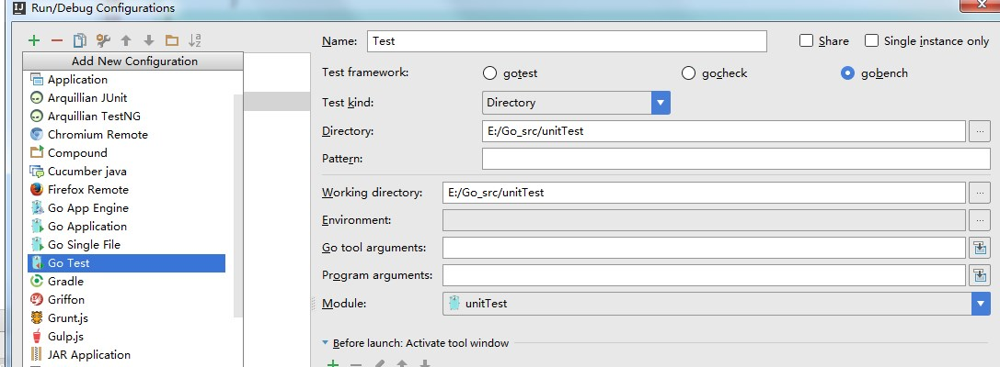

# 单元测试
在需要测试的包下面创建以“_test”结尾的go文件，如*_test.go  

- 功能测试函数  
  ```
  //以Test为函数名前缀，t *testing.T为单一参数
  func TestAdd1(t *testing.T) 
  ```
  根据是否错误返回不同结果  
  使用方法  
  go test
- 性能测试函数  
  ```
  //以Benchmark为函数名前缀，t *testing.T为单一参数
  func BenchmarkAdd1(B *testing.b) 
  ```
  打印测试过程中花费的时间  
  使用方法  
  go test -test.bench XXX.go
  
  例子：
  ```
  package main

  import "testing"

  func TestAdd1(t *testing.T) {
      r := Add(1, 2)
      if r != 3 {
          t.Errorf("Add(1, 2) failed. Got %d, expected 3.", r)
      }
  }

  func BenchmarkAdd1(b *testing.B) {
      for i := 0;i<b.N;i++ {
          Add(1,2)
      }
  }
  ```
  
  clion下使用，run->Edit configuration ,点 + 选择go test
  入下图
  